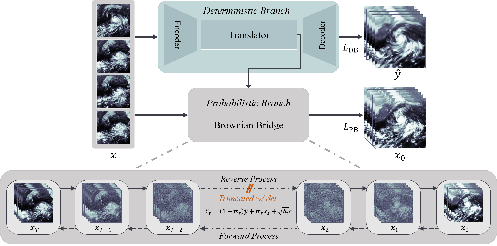

# DGDM : Deterministic Guidance Diffusion Model for Probabilistic Weather Forecasting

Welcome to the official repository for the **[Probabilistic Weather Forecasting with Deterministic Guidance-based Diffusion Model](https://arxiv.org/abs/2312.02819)**. This repository hosts the implementation of DGDM, a novel approach that leverages diffusion model to provide high-accuracy probabilistic
weather forecasting.

  

## Getting Started

To make full use of this repository, we recommend following the steps below to set up the environment and download the required datasets.

### 1. Environment Setup
```bash
conda create -n [name] python==3.9
conda activate [name]
pip install -r requirements.txt
```

### 2. Datasets
#### Moving MNIST
The original link was blocked. We replaced it with a different link. If this link doesn't work, download it another way.

```bash
cd ./data/moving_mnist
bash download_mmnist.sh
```
The dataset structure should look like this:
```bash
$ tree data/moving_mnist
├── mnist_test_seq.npy
└── train-images-idx3-ubyte.gz
```

#### PNW-Typhoon
- Download PWN-Typhoon dataset from [Link](https://drive.google.com/drive/folders/1_bI1t-hWEEZiJx8rCIUKnmWVuH23_z0O) and place it under ```data/``` directory.

# Usage
Once the environment and datasets are prepared, you can begin training and testing the DGDM. Below are instructions for running the model on Moving MNIST; similar steps apply to other datasets.

## Train

```bash
python main.py -c configs/Template-MovingMNIST.yaml -t -r set/your/save/dir
```

## Test

```bash
python main.py -c configs/Template-MovingMNIST.yaml -r set/your/save/dir
```

## Citation
If DGDM contributes to your research, we kindly ask you to acknowledge our work:

```latex
@misc{yoon2023deterministic,
      title={Deterministic Guidance Diffusion Model for Probabilistic Weather Forecasting}, 
      author={Donggeun Yoon and Minseok Seo and Doyi Kim and Yeji Choi and Donghyeon Cho},
      year={2023},
      eprint={2312.02819},
      archivePrefix={arXiv},
      primaryClass={cs.CV}
}
```

## Reference
This project draws inspiration and builds upon several key works in the field. We are grateful for the contributions made by the following repositories, which laid the foundation for our advancements:

- [BBDM](https://github.com/xuekt98/BBDM)
- [VDM](https://github.com/lucidrains/video-diffusion-pytorch)
- [SimVP](https://github.com/A4Bio/SimVP-Simpler-yet-Better-Video-Prediction)
